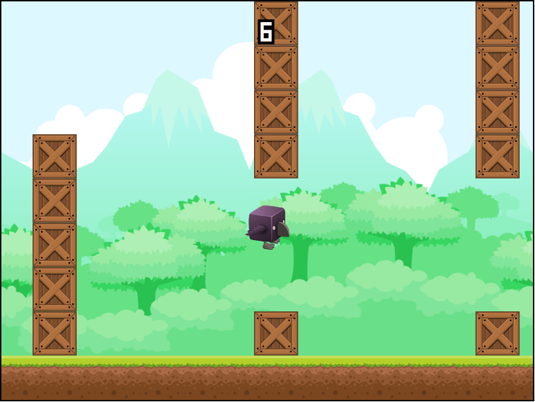

# Game

This application is a small game featuring a flapping bird. The objective of the game is to make the player fly as far as possible without hitting the ground or any obstacles. But in its current state there is neither any birds, nor any flapping. There's a series of tasks that you need to do in order to finish it.

## Instructions

So, right now, the game only draws some rectangles. The rectangle in the middle represents the player character and the squares at the bottom represents the ground. It seems like the game doesn't do much, but actually there's a lot going on in the background.

The application has a main loop where it updates the game state and then renders it in each iteration. This means that the squares we see have not only been drawn a single time but is actually being drawn several times each second. Since they are being drawn in the same place each time, we can't see it.

To update the game state, the game has a tiny physics engine, in the form of the `Simulator` class. It simulates physical forces on the player entity and updates its position over time. Since we can see that the player is not moving, we know that there currently aren't any forces in effect. Our first goal is to fix this so that we can get the player moving.

Besides updating the game state, the physics engine should also detect collisions. In our case, we want the game to end if the player hits something; either the ground or an obstacle. All the different objects in the game are represented by their own class, and each of those classes inherits from the `Entity` class. To help with collision detection, each entity has a `hasCollided` method.

The `Entity` class also has a `draw` method, which currently draws a rectangle in the correct size. Now, we could also try to draw something a bit more interesting than this. There is an `Asset` class which also has a `draw` method that we can use for easily drawing images.

Then, to make the game a bit more fun, we should add some sounds. There are two suitable events in the game that could benefit from having a sound effect; when the bird flaps and when it hits something. There is a `Sound` class with a `play` method for an easy way to play sounds.

The player experience will be better if we display some useful information, like the current score. The `Renderer` class handles all rendering of the different entities. It also contains a convenient `drawText` method that we can use to draw text on top of the rest of the game at different positions.

Lastly, we should add some obstacles for the bird to avoid, which come in the form of stacks of crates. There is a `Crate` class that represents a single crate and a `Stack` class which creates a stack of multiple crates.

**Note:** In order to start the game, we need to click somewhere on the canvas. So, if you're wondering why nothing is happening, you've probably just forgot to click.

### Step-by-step instructions

1. Our first task is to get the player moving. The code responsible for this is found in the file `physics.coffee`. The way it works is by integrating the velocity and position of the player over time. That means that we take small time steps and calculate new values for the velocity and position of the object using [Newton's second law](http://en.wikipedia.org/wiki/Newton%27s_laws_of_motion#Newton.27s_second_law).

  The integration of the velocity is already done but the one for the position is missing from the function `calculatePosition`. Also, the acceleration of the player in the function `calculateAcceleration` is currently set to 0, causing the player to be suspended in mid air. Let's add some gravity and see what happens. The constant for gravity is already declared in the variable `@gravity`. You can simply assign this value to the player's acceleration along the Y-axis, `player.acceleration.y`, to apply it.

  Then, we can add the acceleration caused by the force of a wingbeat to allow the player to fly. This force is available in the variable `force` and the player's mass can be found in `player.mass`.

2. Now, let's make it sound as if the bird is flapping. The `app.coffee` file handles all player interaction and the code for when the player flaps is found in the `onClick` function.

  From within this function, we can access the object called `sounds` that contains two attributes: `flap` and `collide`. Each of these attributes are instances of the `Sound` class.

  Make the correct sound play each time the player flaps by calling the `play` method on one of these instances.

3. We can now start drawing images instead of just rectangles.

  Each object that is being drawn on the screen is an instance of the `Entity` class found in the `entity.coffee` file. The entities all have an `@asset` property that in turn is an instance of the `Asset` class.

  By removing the code that draws the rectangles in the `draw` method of the `Entity` class and replacing it with a call to the `draw` method of the `@asset` property, we will start drawing images instead.

  The `draw` method of the `Asset` class takes three parameters: `ctx`, `x`, `y`, `w` and `h`. All of these variables are already available so you just need to pass them on in the function call.

4. Next, we should draw some text to visualize the current score. This should be done in the `drawUI` method in `renderer.coffee`.

  Besides the score, we can also draw some text based on the game state. We could add a hint at the start on how to start playing and another text when the game ends due to a collision.

  To draw text we will use the `drawText` method. It takes the following parameters: `text`, `size` and `pos`. `text` is the string that you want to display, `size` is the size of the font and `pos` is the vertical position on the screen that you wish to place the text in. The text is always drawn centered, so there is no need to define the horizontal position of the text.

5. Now, we want some more obstacles than just the ground. Let's create some stacks of crates. To do this, we should set `entities.stacks` to an array filled with at least three stacks of crates in the `reset` function of `app.coffee`. To create a single stack we need to call the constructor of the `Stack` class with two arguments: `assets.crate` and `world`.

  When this is done, we have a few static stacks but after the player has moved past them there are no more obstacles. That won't do. So, let's move one of the old stacks that the player has already passed and is out of view, to a place in front of the player to get a seemingly infinite amount of obstacles!

  This can be achieved in the `simulate` method in `physics.coffee`. We already keep track of if a stack has been cleared or not with the `stack.cleared` property. Likewise, there is a method called `isVisible` of the `Stack` class that can be used to check if the stack is within view or not. You should call the `isVisible` method with two arguments: `@camera` and `player`.

  The stack is then moved with the `move` method which takes a single parameter: `pos`. This is the new position of the stack, and should be based on an offset from its previous position, `stack.pos`.

6. Next up, we need to check for collisions in the `detectCollisions` function. Collisions need to be detected between the player and all possible objects that the player can collide with. In our case that is the ground and the stacks.

  The `Entity` class has a `hasCollided` method that takes another entity, `other`, and returns a boolean value which indicates whether a collision has taken place between them or not. Use this method to check for collisions and store the result in the variable `collided`. The entities for the ground and the stacks can be found in `@entities.ground` and `@entities.stacks`.

7. Did you notice that even though we check for collisions with the ground, we can never trigger a collision with it? That is because the implementation of the `hasCollided` method of the `Ground` class in `ground.coffee` is incomplete. Our next task is to fix this.

  We need to create an expression that evaluates to `true` when the other entity, `other`, overlaps with the ground, `this`, and `false` otherwise. The relevant properties of the `Entity` class that we will need are: `position.y` and `height`.

8. Lastly, let's add a sound for our collisions. Play the correct sound in the `onCollision` function in `app.coffee`.

## Screenshot

## Credits

The game contains free assets from [Glitch](http://www.glitchthegame.com/), [Game Art 2D](http://www.gameart2d.com/) and [Freesound](http://www.freesound.org/), as well as the font [04b-19](http://www.04.jp.org/).

The actual sounds being used are found here:

 * [Flapping sound](http://www.freesound.org/people/ani_music/sounds/244981/)
 * [Collision sound](http://www.freesound.org/people/BristolStories/sounds/46136/)
